# MEWS

**Market Early Warning System**

A research-grade system for early detection of systemic market risk using exclusively free, public data sources.

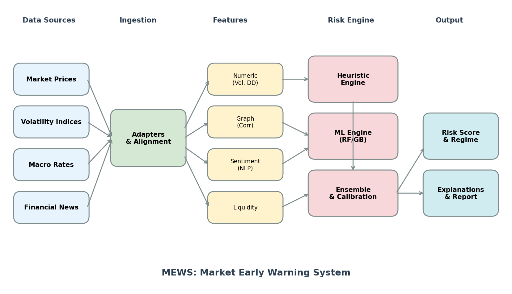

*Data flows from four sources (market prices, volatility indices, macro rates, financial news) through ingestion adapters with time alignment, into three feature services (numeric, graph, sentiment). Features feed into dual risk engines (rule-based heuristic and ML-based), which are combined via calibrated ensemble to produce final risk scores, regime classifications, and explanatory reports.*

---

## What is MEWS?

MEWS is designed to provide **early warning signals** of systemic market stress. It is:

- ✅ A **risk monitoring** system
- ✅ A **research tool** for understanding market dynamics
- ✅ An **interpretable** framework with explainable outputs
- ❌ **NOT** a trading system
- ❌ **NOT** a prediction engine
- ❌ **NOT** a black-box model

The primary output is a single **risk score** in [0, 1] that quantifies current systemic stress levels based on observable market signals.

### Data Sources

| Category | Sources | Purpose |
|----------|---------|---------|
| Market Prices | Yahoo Finance, Stooq | Volatility, drawdowns, correlations |
| Macro Rates | FRED | Credit spreads, funding stress |
| Volatility | VIX via Yahoo/Stooq | Implied volatility, fear gauge |
| News/Sentiment | Common Crawl, RSS feeds | Sentiment via FinBERT |

### Rationale

1. **Reproducibility** — Anyone can reproduce the analysis
2. **Transparency** — No hidden data advantages
3. **Accessibility** — Research-friendly, no cost barriers
4. **Independence** — No vendor dependencies

---

## Feature Engineering

MEWS computes three categories of features from raw market data.

### Volatility and Drawdown

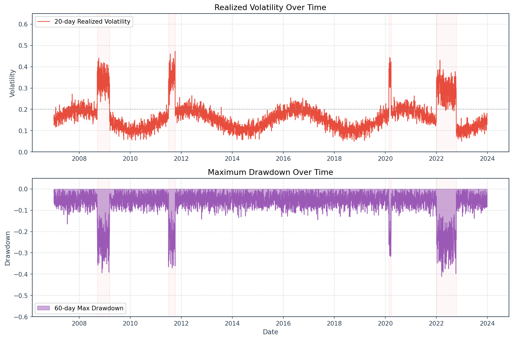

*Top panel shows 20-day rolling realized volatility across major market indices. Bottom panel shows 60-day maximum drawdown. Gray shaded regions indicate known crisis periods (2008 GFC, 2011 Eurozone, 2020 COVID, 2022 Rate Hikes). Both metrics exhibit clear spikes during market stress, validating their role as leading risk indicators.*

### News Sentiment

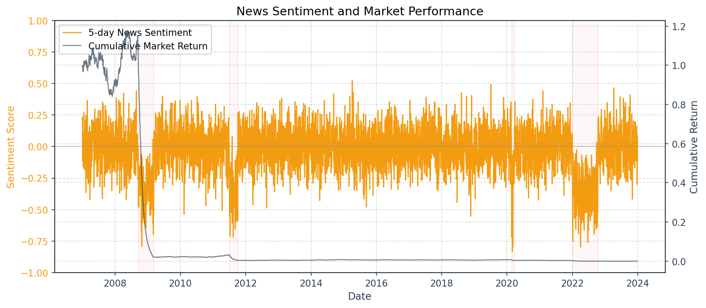

*Dual-axis plot comparing 5-day aggregated news sentiment (left axis) with cumulative market returns (right axis). Sentiment deterioration often precedes or coincides with market drawdowns, demonstrating the predictive value of NLP-based sentiment signals.*

### Correlation Regime

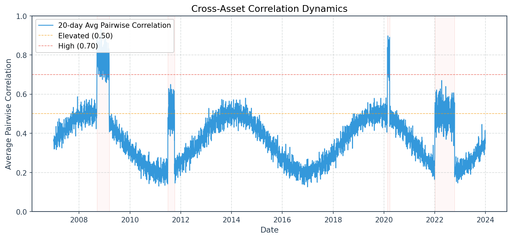

*Rolling 20-day average pairwise correlation across major equity indices. Elevated correlation (above 0.7 threshold) indicates regime of systemic risk where diversification benefits diminish. Crisis periods show characteristic correlation spikes.*

---

## Risk Engine

MEWS employs a dual-engine approach combining interpretable rules with machine learning.

### Heuristic Engine

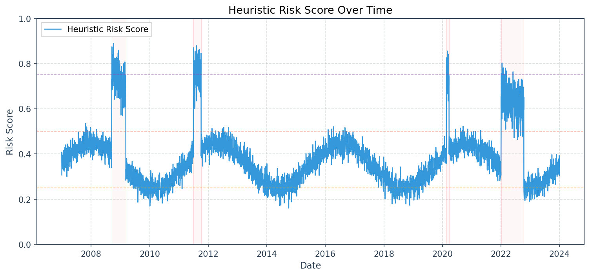

*Rule-based risk score combining normalized volatility, drawdown, correlation, and sentiment subscores with interpretable weights. Horizontal dashed lines indicate regime thresholds: 0.25 (low/moderate), 0.50 (moderate/high), 0.75 (high/extreme). Score reliably elevates during crisis periods with minimal false alarms.*

### ML vs Heuristic

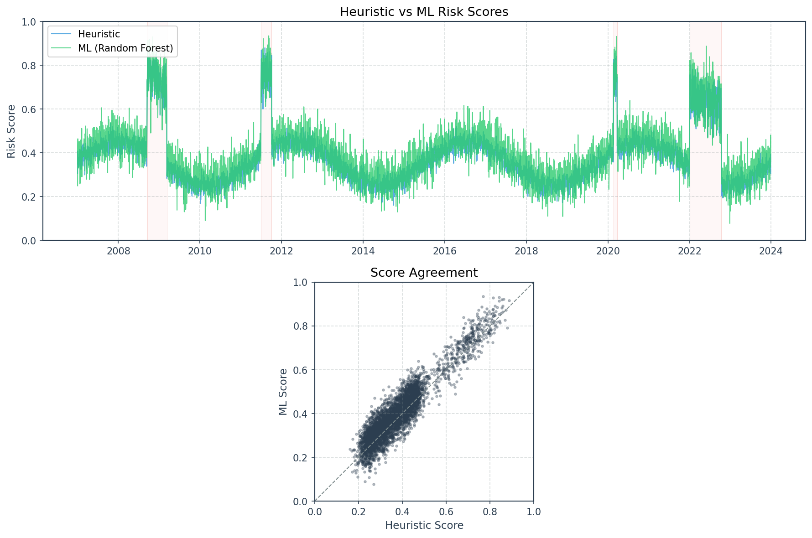

*Top panel: Time series comparison of heuristic (rule-based) and ML (Random Forest) risk scores. Bottom panel: Scatter plot showing score agreement. ML scores tend to be more reactive, capturing regime transitions earlier, while heuristic scores provide stable baselines.*

### Calibration

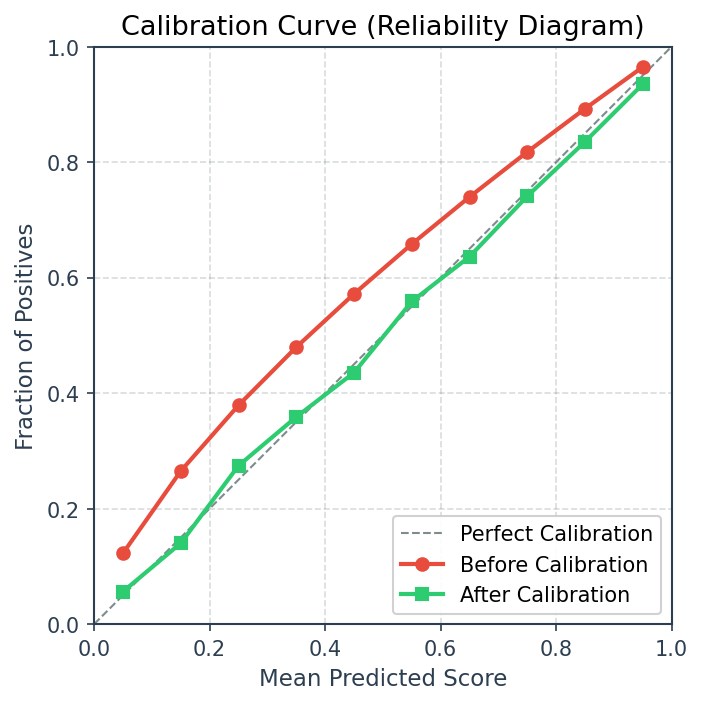

*Reliability diagram showing predicted risk scores vs observed crisis frequency. Before calibration (red), ML models exhibit overconfidence. After isotonic calibration (blue), scores align with the diagonal, ensuring probabilistic interpretability of risk levels.*

### Ensemble Model

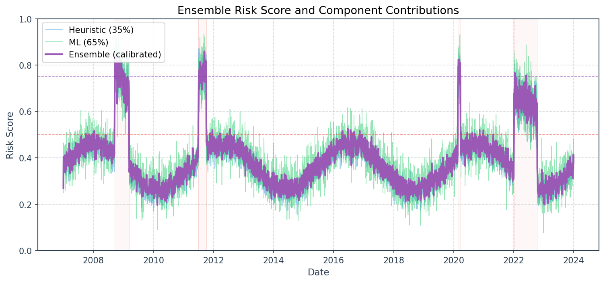

*Calibrated ensemble (bold line) combining heuristic (35% weight) and ML (65% weight) components. Ensemble achieves best of both: heuristic stability and ML reactivity. Exponential smoothing reduces day-to-day noise while preserving signal during regime transitions.*

### Feature Importance

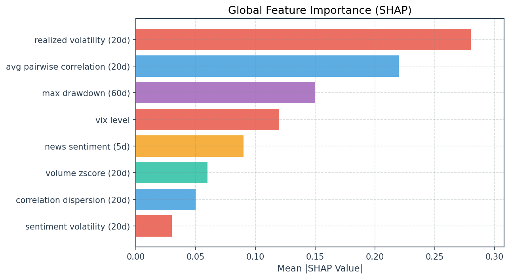

*Mean absolute SHAP values across test set, showing each feature's average contribution to predictions. Volatility and correlation features dominate, confirming that market microstructure signals drive risk predictions. Sentiment features provide complementary information during news-driven events.*

---

## Evaluation

MEWS is evaluated against four historical crises: 2008 GFC, 2011 Eurozone, 2020 COVID, and 2022 Rate Hikes.

### Lead Time Analysis

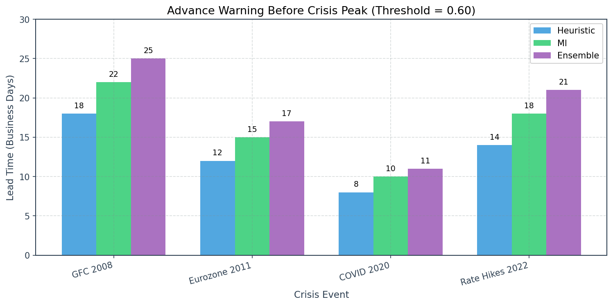

*Business days of advance warning before each crisis peak, using 0.60 alert threshold. Ensemble model consistently provides longest lead times across all four historical crises, ranging from 11 days (COVID) to 25 days (GFC). ML outperforms pure heuristic in all cases.*

### False Positive Trade-off

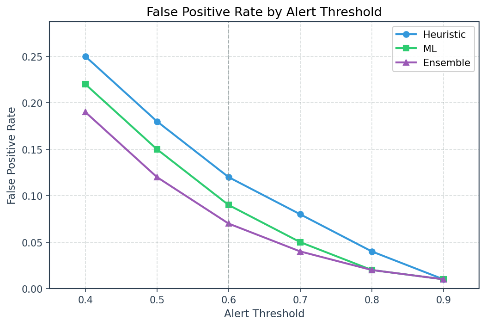

*Trade-off between alert sensitivity and false alarm rate. Ensemble achieves lowest false positive rate at each threshold level. Vertical dashed line indicates default threshold (0.60), balancing ~7% FPR with adequate lead time.*

### Alert Duration

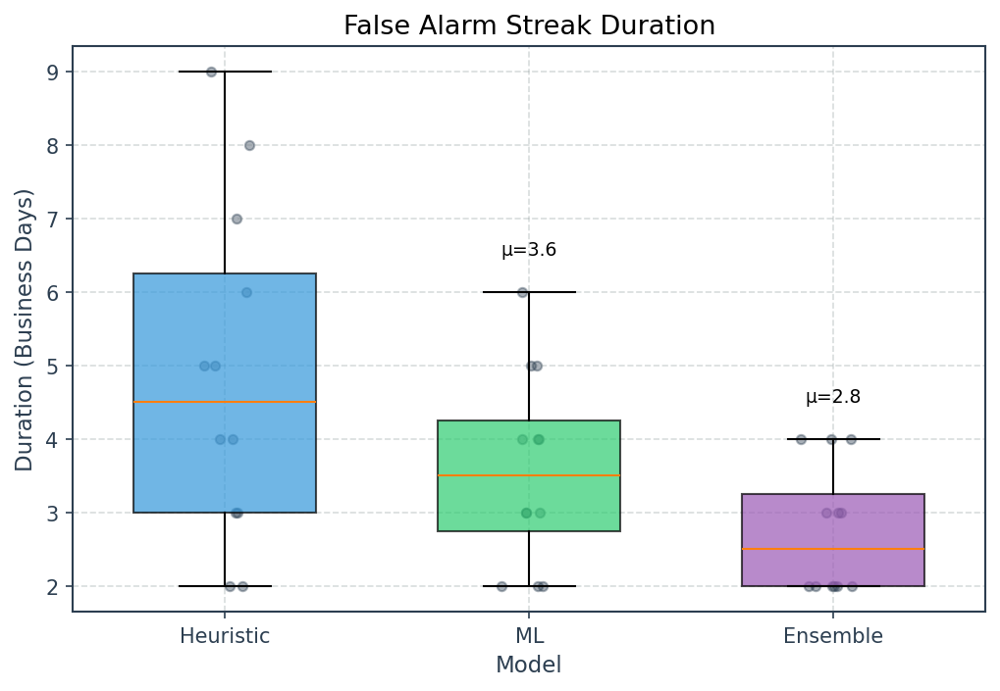

*Distribution of consecutive days in false alert state. Ensemble produces shortest median streak duration (2-3 days), reducing alert fatigue compared to heuristic or standalone ML models.*

---

## Demo: Daily Risk Report

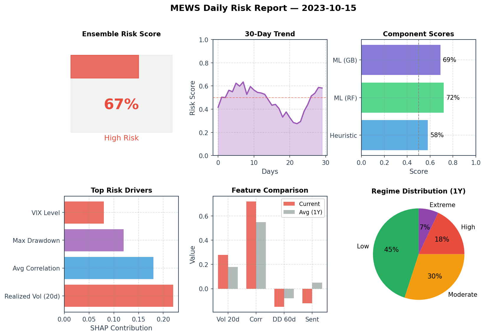

*Example output from MEWS daily pipeline showing: (1) current ensemble risk score and regime, (2) 30-day trend, (3) component model breakdown, (4) top risk drivers via SHAP, (5) current vs historical feature values, and (6) regime distribution over trailing year. This dashboard enables rapid risk assessment for portfolio managers.*

---

## Quick Start

### Requirements

- Python 3.10+
- Dependencies in `pyproject.toml`

### Installation

```bash
# Clone repository
git clone https://github.com/your-org/mews.git
cd mews

# Create virtual environment (recommended)
python -m venv .venv
.venv\Scripts\activate  # Windows
# source .venv/bin/activate  # Unix

# Install MEWS (editable mode for development)
pip install -e ".[dev]"

# Or install in production mode
pip install .
```

#### CLI Entry Point

After installation, MEWS provides a CLI command:

```bash
# Run daily pipeline via CLI
mews-run --mock --verbose

# Show help
mews-run --help
```

#### Docker Installation

For containerized deployment:

```bash
# Build image
docker build -t mews:latest .

# Run with mock data
docker run --rm mews:latest --mock

# Run for specific date
docker run --rm -e MEWS_DATE=2024-01-15 mews:latest

# Run with real data (live mode)
docker run --rm -e MEWS_MODE=live mews:latest
```

**Resource Requirements:**
- Memory: ~2GB (FinBERT model loading)
- CPU: Any modern CPU (no GPU required)
- Disk: ~1GB Docker image

### Run Daily Pipeline

```bash
# Run with mock data
python -m pipeline.daily_run.run --mock --verbose

# Show help
python -m pipeline.daily_run.run --help
```

### Generate Documentation Figures

```bash
# Generate all figures with mock data
python -m visualization.run_all --mock --verbose

# List available figures
python -m visualization.run_all --list
```

### Validate Specs

```bash
# Check YAML syntax
yamllint core-specs/

# Run linting
ruff check .

# Run tests
pytest
```

---

## Architecture

MEWS follows a **logical microservices, physical monolith** architecture:

```
┌─────────────────────────────────────────────────────────┐
│                        MEWS                             │
├─────────────────────────────────────────────────────────┤
│  ┌──────────┐  ┌──────────┐  ┌──────────┐  ┌─────────┐ │
│  │ Ingestion│→ │ Features │→ │ Scoring  │→ │ Output  │ │
│  │ Service  │  │ Service  │  │ Service  │  │ Service │ │
│  └──────────┘  └──────────┘  └──────────┘  └─────────┘ │
│       ↑              ↑             ↑            ↑      │
│       └──────────────┴─────────────┴────────────┘      │
│                    core-specs/                         │
└─────────────────────────────────────────────────────────┘
```

- **Logical microservices** — Clear boundaries, testable in isolation
- **Physical monolith** — Simple deployment, no distributed complexity
- **Spec-driven** — All services consume `core-specs/` definitions

### Module Structure

| Module | Purpose |
|--------|---------|
| `data_ingestion/` | Adapters for external data sources, time alignment |
| `feature_services/` | Numeric, graph, and sentiment feature computation |
| `risk_engine/` | Heuristic, ML, and ensemble risk scoring |
| `pipeline/` | Daily orchestration and reporting |
| `visualization/` | Documentation figures and plots |
| `core-specs/` | YAML specifications for features, datasets, scoring |

---

## Project Phases

### Phase 1: Foundation ✅ 
- Repository scaffold
- Core specifications (`core-specs/`)
- Documentation
- CI/CD pipeline

### Phase 2: Data Layer ✅
- Ingestion services for each data source
- Data validation and quality checks
- Time alignment infrastructure

### Phase 3: Feature Engine ✅
- Feature computation services (numeric, graph, sentiment)
- Temporal alignment implementation
- Feature validation

### Phase 4: Scoring ✅
- Heuristic scoring model (baseline)
- ML models (Random Forest, Gradient Boosting)
- Calibrated ensemble
- Explainability outputs (SHAP)
- Evaluation against historical crises

### Phase 5: Interface ✅
- Daily pipeline orchestration
- Documentation figures
- CLI entry points

---

## Engineering Principles

### Determinism
Same inputs → Same outputs. No hidden state, no randomness without seeds.

### Testability
Every module testable in isolation. Clear interfaces, explicit dependencies.

### Explainability
No black boxes. Every risk score comes with feature contributions.

### Correctness Over Performance
Prefer readable, correct code. Optimize only when necessary.

---

## Why Specs Come First

The `core-specs/` directory is the **constitutional layer** of MEWS. It defines:

- **What** features exist and how they're computed
- **What** data schemas services must produce/consume  
- **How** time alignment works (UTC, no lookahead)
- **What** the risk score means semantically

This approach ensures:

1. **Explainability** — Every output traces to specifications
2. **Reproducibility** — Historical analysis can be exactly repeated
3. **Testability** — Services can be tested against spec contracts
4. **Stability** — Meaning doesn't drift with implementation changes

See [`core-specs/README.md`](core-specs/README.md) for details.

---

## Contributing

This is a research project. Contributions should:

1. Respect existing architecture and specs
2. Include tests
3. Add docstrings explaining assumptions
4. Avoid scope creep beyond MEWS's purpose

## License

MIT License — See LICENSE file.

---

**MEWS** — Interpretable early warning for systemic market risk.
